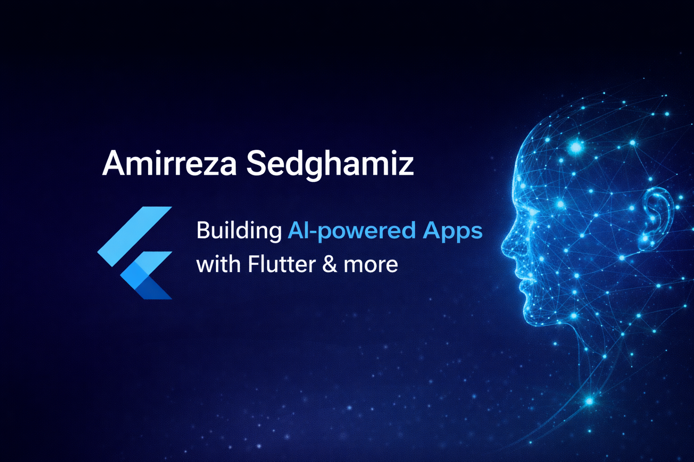

  

<!-- Header Typing Animation -->
<h2 align="center">
  
</h2>

---

# 👋 Hi, I'm **Amirreza Sedghamiz**

### **Flutter Developer • Mobile Engineer • Software Problem-Solver**

I’m a Flutter developer with **4+ years of experience**, specializing in building scalable, production-ready mobile apps.  
I’ve delivered applications used by **100k+ active users**, multiple freelance client apps, and university projects with real architecture and database logic.

I focus on **clean code, reliability, and user-centered design**.

---

## 🔹 **What I Do**
- Cross-platform development with **Flutter (Android/iOS/Web)**
- Custom UI/UX components & responsive layouts  
- REST API integration & Firebase services  
- State management (**Provider**)  
- Offline-first applications & caching  
- Sentry analytics, crash monitoring & debugging  
- CI/CD automation and build pipelines  
- Experimenting with **LLM fine-tuning & NLP**

---

## 🔹 **Tech Stack**

  

---

## 🔹 **Highlighted Projects**

### **📱 eKeep — 100k+ Users (Production App)**
A multilingual financial/social application rebuilt from scratch.  
Includes polls, galleries, charts, notifications, SSO, offline mode, PWA, and Sentry monitoring.

### **🍽 Food Ordering App (Database Final Project)**
Role-based system (Admin, Manager, Customer) built with complete ERD, SQL stored procedures, ordering workflows, and full UI.

### **📚 LeadLearn**
Educational app with modular architecture, clean UI, and Flutter best practices.

---

## 🔹 **GitHub Analytics**

  
  

  

---

## 🔹 **Visitor Counter**

  

---

## 🔹 **Contact**
📫 Email: **amir7007.sed@gmail.com**  
🌐 LinkedIn: [linkedin.com/in/amirreza-sedghamiz](https://linkedin.com/in/amirreza-sedghamiz)

---

